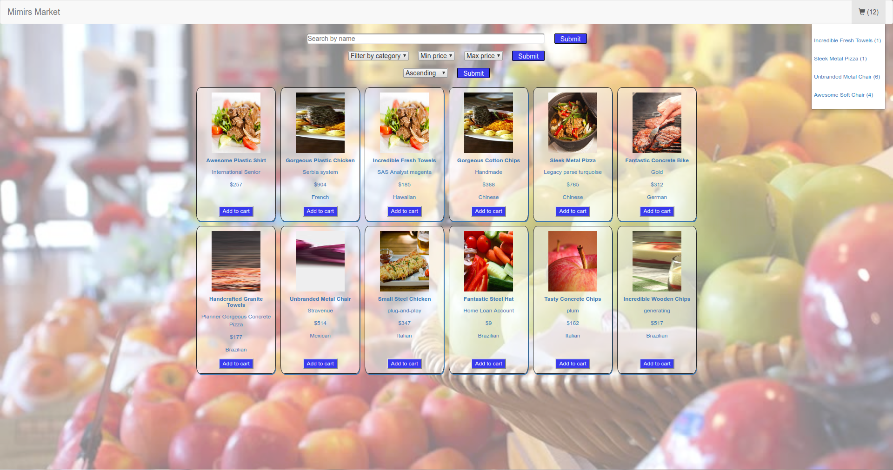
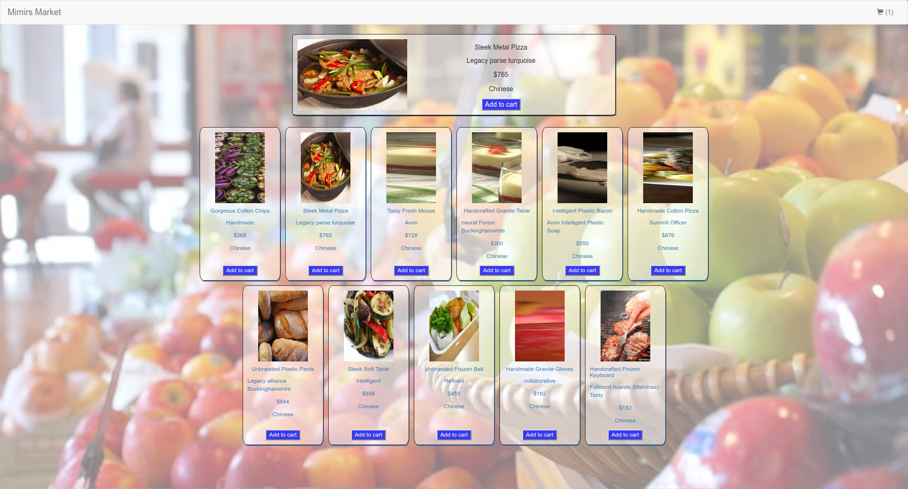
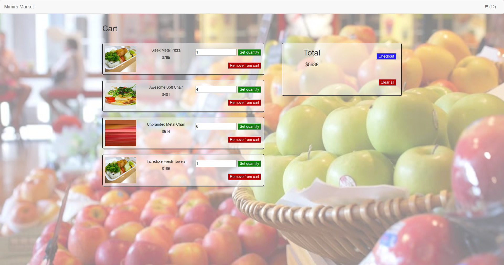

# Mimirs Market

An e-commerce market where users can choose from among dozens of delicious foods. You can filter the foods based on various criteria; such as category, price, and name; sort them in alphabetical order, and/or manipulate them in your cart! ...checkout coming soon

#### Note: On deployed site, you will probably have to wait about 20 seconds on the first visit, because free Heroku dynos go to sleep after 30 min of inactivity

## Walkthrough

From the home page, you can filter and sort the food items, and you can also easily add them to your cart. Clicking on an image takes you to the single-food display (below), while clicking on the cart shows you the items you currently have and their quantity.

The single-food display page shows you the food you clicked on and other food items in the same category.

Clicking on an item in your cart takes you to the cart adjustment page. You can modify the quantity of an item and see that update the total in your cart. You can also remove items individually, clear the cart copmletely, or checkout.

